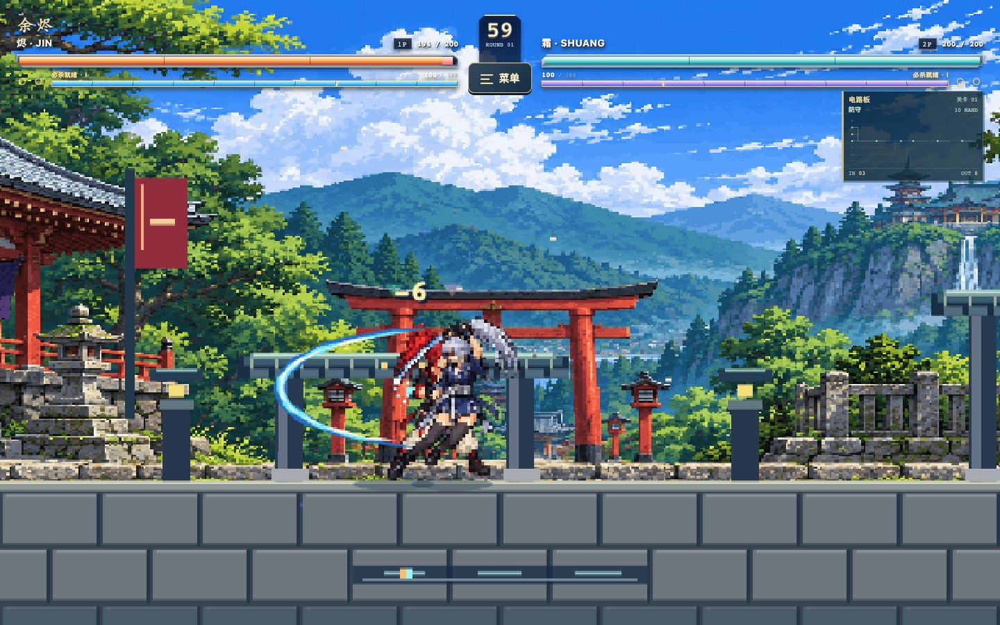
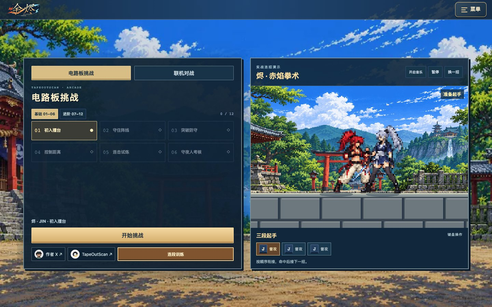
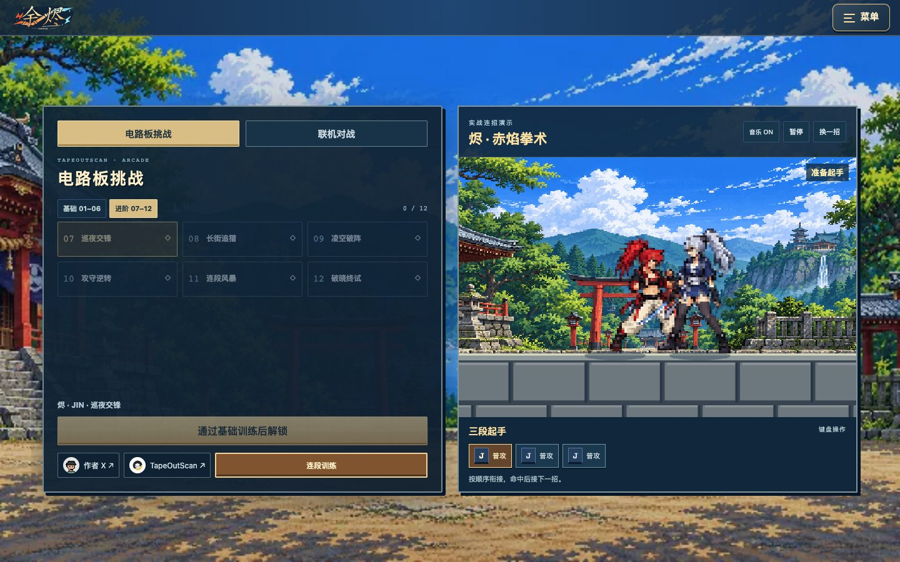
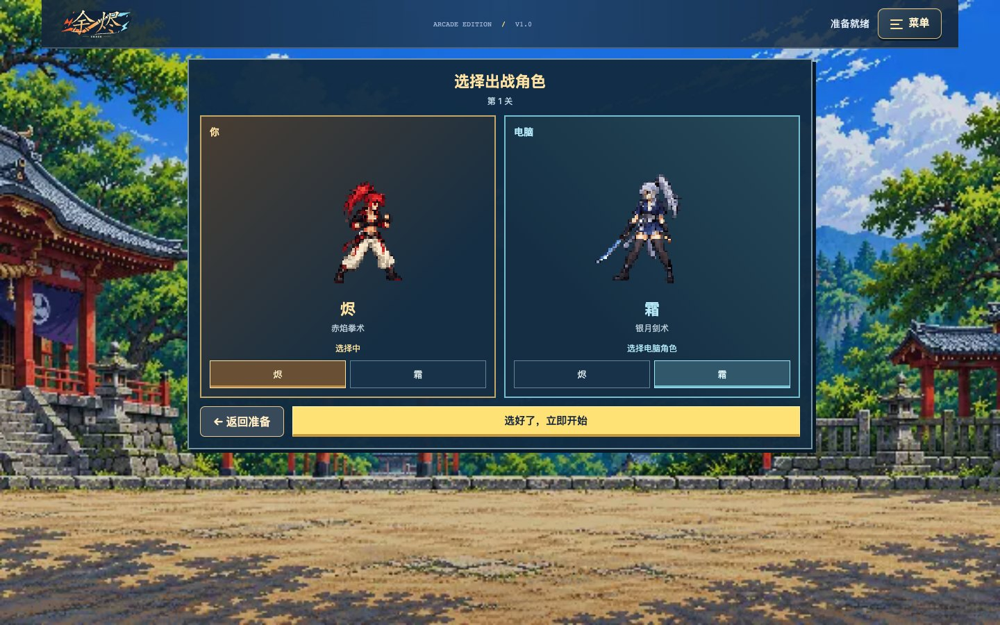
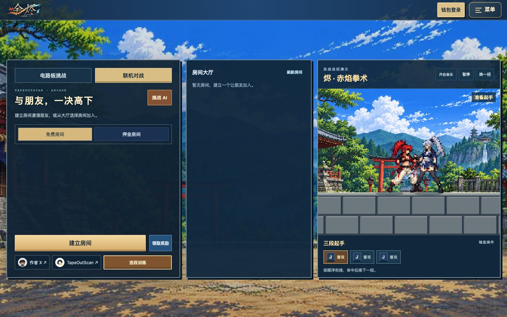
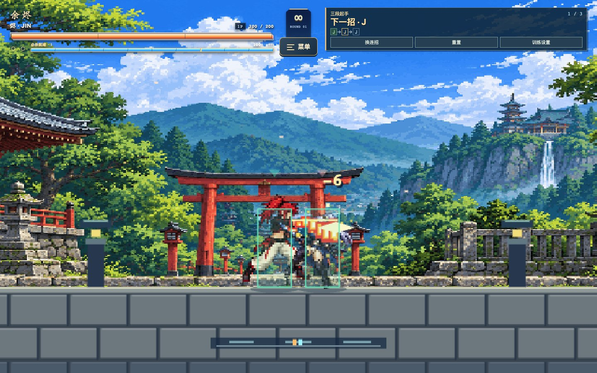
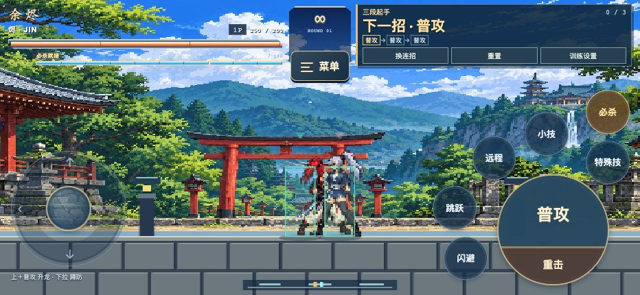
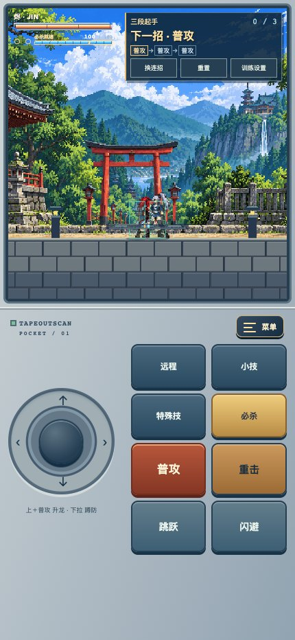

<p align="center"></p>
<h1 align="center">🔥 余烬 · EMBER</h1>
<p align="center"><strong>像素格斗 × DeWeb × X Layer</strong><br>与好友打一场，看见电路 AI 的每一次判断。</p>
<p align="center"><a href="https://2-2-300.deweb.tapeoutexplorer.com/">🎮 立即游玩 · DeWeb</a> · <a href="https://tapeoutexplorer.com/games/ember/">备用网页入口</a> · <a href="docs/README.en.md">English</a> · <a href="https://x.com/benson_doge">作者 X</a> · <a href="https://tapeoutexplorer.com/">TapeOutScan</a></p>



**《余烬》已发布到 X Layer 的 DeWeb 容器 `2.2.300.tape`。** 选择赤焰拳手「烬」或银月剑士「霜」，挑战 12 道电路关卡、练习连段，或邀请好友进行实时 PVP。免费模式直接开玩；押金对战支持 X Layer 上的 OKB / BEM，钱包登录、授权、付款和领奖各有清晰状态。

本仓库是 **TapeOut Genesis Transistor Hackathon** 项目的公开介绍、演示与源码入口。评审可直接访问游戏、浏览下面的截图，并查阅 [完整参赛披露](docs/HACKATHON.md)。参赛不代表官方背书或获奖。

## 现在可以玩什么

| 玩法 | 内容 | 是否需要钱包 |
| --- | --- | --- |
| 电路板挑战 | 12 关，由基础控距、防守、连击逐步进阶；显示正在执行的 AI 电路信号 | 不需要 |
| 连段训练 | 无限生命、木桩行为设置、命中与伤害统计、下一招提示和完整动作顺序 | 不需要 |
| 免费 PVP | 从公开房间大厅建房／加入；双方选角，实时对战 | 不需要 |
| 押金 PVP | 双方使用等额 OKB 或 BEM；付款后选角，赛后按合约结算 | 需要 X Layer 钱包 |
| 手机游玩 | 横屏街机布局、竖屏掌机布局；网页 App 安装与旋转引导 | 免费玩法不需要钱包 |

**最新公开源码：`1.3-scan.5`（2026-10-10 同步）。** 包含钱包会话恢复、手机钱包唤起衔接、押金状态恢复、实时选角、奖励领取状态和全部弹窗关闭等近期改进。钱包 App 的系统跳转仍受设备、浏览器及钱包版本影响。

## 游戏画面

### 12 关电路板挑战与首页连招演示



基础 01–06 关帮助熟悉格斗；进阶 07–12 关加强反应、防守、控距与连招衔接。通关进度保存在当前浏览器，换设备或清除站点数据不会自动同步。

<details><summary>展开查看进阶关卡</summary>



</details>

### 两位角色，左右独立选角



左边选择自己的角色；单人模式可选择电脑角色，真人 PVP 的右侧实时展示对方选择。进入真人房间后选角，押金房则先完成双方付款。

### 公开房间大厅



选择「联机对战」→ 免费房间或押金房间 → 建立房间，好友直接从大厅加入，无需房间码或密码。免费玩法不会强制要求钱包登录。

### 连段木桩训练



从「连段训练」开始，按右上角顺序练习。**实际命中才计入连段**，不是只看按键是否按过。可以换连招、重置位置、设置木桩格挡，并查看伤害与连击结果。

### 横屏街机，竖屏掌机



<p align="center"></p>

横屏保留街机技能布局；竖屏将画面放在上方、操作放在下方。左边只放摇杆，右边放全部动作，普攻／重击分区，跳跃与闪避有独立按键。以上均为当前源码在隔离浏览器中运行的截图，不含真实钱包资料。

## 一分钟上手

1. 打开 [DeWeb 游戏](https://2-2-300.deweb.tapeoutexplorer.com/)，先选「电路板挑战」或「连段训练」，无需钱包。
2. 选「烬」或「霜」，确认进入。电脑使用键盘；手机使用画面上的摇杆和技能按钮。
3. 先练三段普攻，再尝试升龙追击。下一招在命中后衔接，不要把整套按键一次按完。
4. 与好友对战时切换「联机对战」，建立免费房间，让好友从大厅加入。
5. 希望使用押金对战时，再连接 X Layer 钱包，核对资产、每人金额与钱包确认内容。

| 动作 | 电脑键盘 | 手机 |
| --- | --- | --- |
| 移动 / 蹲伏 | A、D / S | 左摇杆左右 / 下拉 |
| 普攻 / 重击 | J / H | 普攻 / 重击 |
| 跳跃 / 闪避 | K / L（或 Shift） | 跳跃 / 闪避 |
| 远程 / 小技 | U / O | 对应技能键 |
| 特殊技 / 必杀 | E / I | 特殊技 / 必杀 |
| 升龙 | W + J | 摇杆上推 + 普攻 |
| 防御 / 菜单 | F / Esc | 摇杆下拉蹲防 / 菜单 |

**三段起手：** `J → J → J`，手机连续点「普攻」。
**升龙追击：** `W+J → K → J → J → H`，手机为「摇杆↑＋普攻 → 跳跃 → 普攻 → 普攻 → 重击」。

[完整操作与手机安装指南 →](docs/CONTROLS.md)

## 钱包、押金与奖励

- **网络是 X Layer 主网（196），Gas 使用 OKB。** 此处的 BEM 是 X Layer 代币，不是 BNB Chain 的同名资产。
- 连接钱包后确认登录签名。登录不支付押金、不授权代币；选择押金房后才进入资金步骤。
- 押金房支持 OKB / BEM。BEM 按需要先授权，再支付；每次资金操作仍需在自己的钱包中确认。
- 双方付款后进入选角；自己已付款时等待对方。准备期限为 180 秒，超时未完成双方付款的退款资格由合约核验，之后从奖励／押金入口领取。
- 正常胜负对局的奖池扣除 10% 平台费用后归胜者；合约设有赛后 60 秒等待，并需后台结算及链上核验完成。历史对局中可继续领取未提取的奖励或退款，也支持一键领取可领项目。
- **BEM 是 TapeOut 生态代币，并非《余烬》发行的游戏代币；游戏仅支持其作为可选押金资产。**

[合约源码、地址与钱包步骤 →](docs/X-LAYER.md)

## DeWeb 上传包与开发

**[下载当前 DeWeb 上传包](downloads/ember-deweb-1.3-scan.5.zip)** · [文件清单](downloads/deweb-manifest-1.3-scan.5.json) · [SHA-256](downloads/SHA256SUMS)

当前包：54 个文件，未压缩站点内容合计 **1,129,497 字节（约 1.08 MiB）**，按 24,000 字节分块计 90 块。内容哈希命名、模块压缩、资源复用、小首页最后更新，便于后续减少重复上传。实际交易数和 Gas 以容器已有内容及链上核验为准。[打包与更新说明](docs/DEWEB.md)

本地运行需要 Node.js ≥ 22.13.0；已打包的运行时依赖包含在仓库中：

```sh
git clone https://github.com/BensonXBX/ember-tapeout.git
cd ember-tapeout
node scripts/start.mjs
```

打开 `http://localhost:3276/games/ember/`。开发服务器默认绑定 `0.0.0.0`；免费模式可直接运行，生产资金配置和密钥不包含在仓库中，本地默认不能创建可支付的主网押金房。

```sh
# 安装开发依赖（使用仓库锁文件）
pnpm install --frozen-lockfile
pnpm test
python3 build.py
python3 build-tools/package-deweb.py
# 另一个终端保持本地服务器运行，再执行免费联机冒烟检查
node test-launch.mjs
```

## 项目实现与披露

- **DeWeb** 保存公开网页资源；**X Layer 托管合约**管理押金与结算；**游戏服务器**负责实时联机、裁判和记录。这不是每一帧都在链上运行的游戏。
- **电路 AI** 在客户端执行 NAND 网表并显示真实信号；传感器、时间、随机状态和战斗引擎仍由游戏层处理。原 AI 路径保留，便于对比与回退。
- TapeOut 处理器、晶体管、电路容器与游戏押金合约是不同对象。已流片的电路 #2 并不是完整 AI 网表。
- 游戏源码及合约源码公开供审阅；合约源码公开不等于第三方安全审计。素材与第三方库遵循各自权利及许可证，见 [第三方说明](THIRD_PARTY_NOTICES.md)。

| 资料 | 内容 |
| --- | --- |
| [黑客松项目披露](docs/HACKATHON.md) | 项目描述、Demo、处理器、部署钱包、供应上限、单价、流片交易 |
| [操作指南](docs/CONTROLS.md) | 键盘／触屏、连招、网页 App、音乐与菜单 |
| [X Layer 与合约](docs/X-LAYER.md) | 网络、资产、押金合约、源码与核验材料 |
| [技术架构](docs/ARCHITECTURE.md) | AI、战斗、联机、链上与链下边界 |
| [上线公告](docs/ANNOUNCEMENT.md) | 中英文发布介绍与比赛计划 |

**持续维护与比赛计划：** 作者计划赞助 **10 BEM** 举办社区比赛，日期、报名方式、使用网络和规则待公布；这不是已经开放领取的奖励。后续消息请关注 [@benson_doge](https://x.com/benson_doge)。
