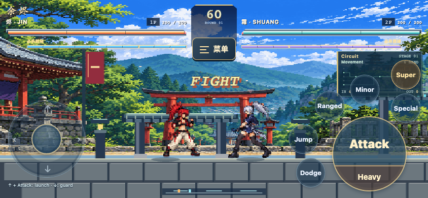

<p align="center"></p>

# EMBER · 余烬

**A pixel fighting game that makes AI logic visible. / 让 AI 电路看得见的像素格斗游戏。**

TapeOutScan Circuit Arcade · TapeOut Genesis Transistor Hackathon submission source

[中文](#中文) · [English](#english) · [Hosted preview / 在线试玩](https://tapeoutexplorer.com/games/ember/) · [TapeOutScan](https://tapeoutexplorer.com/) · [Author / 作者 X](https://x.com/benson_doge)



## 中文

《余烬》将像素格斗、十二关电路板挑战与可视化 NAND 电路 AI 放在同一个轻量网页游戏中。玩家既能练习连招，也能观察对手作出判断时实际执行的门信号。支持电脑键盘、手机横屏触控，以及竖屏复古掌机布局。

- **电路板挑战：** 两名角色、十二个由易到难的关卡，保留原版 AI，可在设置中切换并于下一局生效。
- **真实本地 NAND AI：** 比较、逻辑与动作选择逐门执行；状态面板显示实际信号、连线与输入输出。
- **连段训练：** 完整动作顺序、下一招提示和实时完成判定；大厅循环演示对应电脑／手机按键。
- **免费联机：** 房间大厅、服务端裁判、WebSocket 与 HTTP 回退，无需钱包即可试玩。
- **X Layer 钱包：** 支持 OKX 扩展与手机连接／登录签名。新押金房目前关闭，普通试玩不支付任何代币。
- **DeWeb 构建：** 内容哈希资源、gzip、完整性校验与小首页最后替换，减少后续更新的重复上传。

### 快速运行

需要 Node.js **22.13 或更新版本**；构建 DeWeb 包另需 Python **3.10+**。运行游戏使用随项目提供并保留许可证的依赖，无需先安装 npm 包。

```sh
node scripts/start.mjs
```

浏览器打开 **http://localhost:3276/games/ember/**，进入电路板挑战或连段训练。服务默认绑定 `0.0.0.0`，同一可信局域网可使用本机 IP 访问。手机主屏幕安装和外部钱包联调请使用正确配置的 HTTPS 环境；本地试玩不需要连接钱包。

运行完整测试和重建第三方依赖：

```sh
npm install
npm test
# 在另一个终端保持游戏服务运行，然后执行本地 HTTP/WS 冒烟检查：
npm run smoke -- http://127.0.0.1:3276
```

`npm test` 中的合约测试使用进程内模拟 EVM 和随机测试账户，不向公网链发送交易。

### TapeOut / X Layer 链上记录

| 项目 | 已核验信息 |
| --- | --- |
| 网络 | X Layer 主网，Chain ID 196 |
| 处理器 | TapeOutScan #300 |
| 处理器合约 | `0x9b826bd2984c2a041ee3b8f7168f2620fc5d3281` |
| 晶体管合约 | `0x43ed51dc5bf22ea18ef002be474b94152fe66f0b` |
| 部署钱包 | `0xf2d7422470a7f1c6f37ac9285a54f4254c9b7a7e` |
| 部署时供应上限 | 1,000,000 |
| 部署时铸造单价 | 0.00066 OKB；协议费用与 Gas 另计 |
| 部署时间 | 2026-10-07 21:42:43，UTC+8 |
| 流片证明 | 电路 #2，`2.2.300.tape`，2026-10-07 21:48:23，UTC+8 |

[处理器部署交易](https://www.oklink.com/xlayer/tx/0x3098e008479e19c1b8036fb2d259a4c8a3c970517a744da63c0b4fa2e30cda50) · [电路 #2 流片交易](https://www.oklink.com/xlayer/tx/0xf75fe9fe249a0152efa1ee342296d56249b03d962d18e8916b4f6ea415388632) · [机器可读核验记录](docs/chain-evidence.json)

**当前边界：** 游戏 AI 在浏览器本地运行 NAND 网表。现有链上 #2 是三门电路，不是完整 AI 的链上流片；本版本也没有通过该 NFT 执行游戏决策。该处理器容器是后续 DeWeb 发布目标，上传尚未完成。在线 PvP 依赖服务器，不是全链游戏。源码不代表项目已获赛事资格或奖励。

### 构建和更新

```sh
python3 build.py                         # 生成服务端运行包 dist/
python3 build-tools/package-deweb.py     # 生成前端上传目录 deweb-upload/
# 有上一版清单时，仅列出需要更新的文件：
python3 build-tools/package-deweb.py --previous-manifest /path/to/previous/DEWEB_MANIFEST.json
```

只将 `deweb-upload/` 内的文件上传到网页容器。先上传并回读资源，最后替换 `index.html`；保留旧版资源便于回退。**不要上传整个源码仓库、服务端、数据库或运行配置。** DeWeb 前端的联机与登录仍调用 TapeOutScan HTTPS/WSS 服务；其他域名需配置对应服务端来源许可。详见 [DeWeb 说明](docs/DEWEB.md)。

## English

EMBER is a lightweight pixel fighting game combining a twelve-stage campaign, combo training, free online rooms and an inspectable NAND-circuit AI. It supports desktop keyboards, landscape touch controls and a portrait handheld-style layout. The circuit panel displays signals from real locally evaluated decision circuits rather than an unrelated decorative animation.

The game keeps its original AI as an explicit next-match setting. Physics, sensors, seeded randomness and timing remain in JavaScript; Boolean logic, numeric comparisons and action selection use locally evaluated NAND networks. See [architecture](docs/ARCHITECTURE.md).

**Run:** install Node.js 22.13+, run `node scripts/start.mjs`, then open `http://localhost:3276/games/ember/`. Runtime dependencies and their notices are included. For development, run `npm install` and `npm test`. Contract tests use an in-process simulated EVM, not a public chain.

**On-chain evidence:** TapeOutScan processor #300 was deployed through the TapeOut factory on X Layer on October 7, 2026. Its deployment event records a supply cap of 1,000,000 and a mint unit price of 0.00066 OKB, excluding protocol fees and gas. Circuit #2 was successfully taped out during the same day. Addresses, timestamps and transaction hashes are in [chain-evidence.json](docs/chain-evidence.json).

**Implementation status:** the existing three-gate on-chain circuit is not the complete game AI and is not currently used to execute game decisions. The associated container is a planned DeWeb hosting destination; upload is pending. The circuit AI runs in the browser, while online multiplayer requires the game server. OKX / X Layer login is integrated; new deposit rooms are disabled. Normal campaign, training and free multiplayer require no payment. Submission eligibility is determined by the organizers.

**DeWeb:** run `python3 build-tools/package-deweb.py`. Upload only `deweb-upload/`, verify resources first and replace the small `index.html` last. Content-addressed assets allow unchanged files to be reused. Never upload backend state or credentials. A DeWeb frontend still needs the HTTPS/WSS backend for multiplayer and login.


## Source layout / 源码结构

| Path | Purpose / 用途 |
| --- | --- |
| `public/engine.mjs` | Shared deterministic combat engine / 战斗引擎 |
| `public/campaign.mjs` | Twelve stages, NAND evaluation and original AI / 关卡与电路 AI |
| `public/arena.*`, `public/interface.css` | Entry, combat UI and responsive layouts / 界面与适配 |
| `public/training.mjs` | Combo coach and lobby demonstrations / 连招练习与演示 |
| `public/wallet.mjs`, `public/payments.mjs` | X Layer wallet and payment UI / 钱包界面 |
| `server/` | Rooms, authentication, monitoring and settlement source / 独立游戏服务 |
| `contracts/` | Escrow source and compiler inputs / 托管合约源码与编译资料 |
| `tests/` | Gameplay, input, wallet handoff and simulated contract tests / 测试 |
| `build-tools/` | Vendor, contract and incremental DeWeb builds / 构建工具 |
| `docs/` | Architecture, deployment boundaries and public chain evidence / 说明与证据 |

## Credits / 来源

Based on the author's supplied EMBER v1.0 game package, extended for TapeOutScan with mobile layouts, wallet handoff, free multiplayer infrastructure, circuit AI and DeWeb packaging. Existing third-party notices and Solidity SPDX declarations are retained. See [THIRD_PARTY_NOTICES.md](THIRD_PARTY_NOTICES.md). This repository does not grant additional rights to third-party artwork or dependencies beyond their existing licenses.
